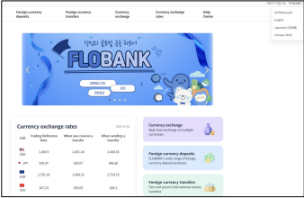
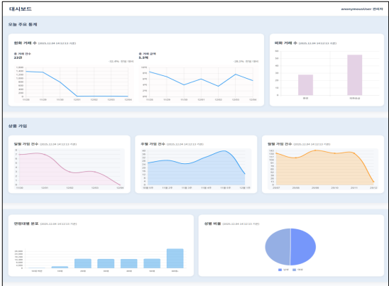
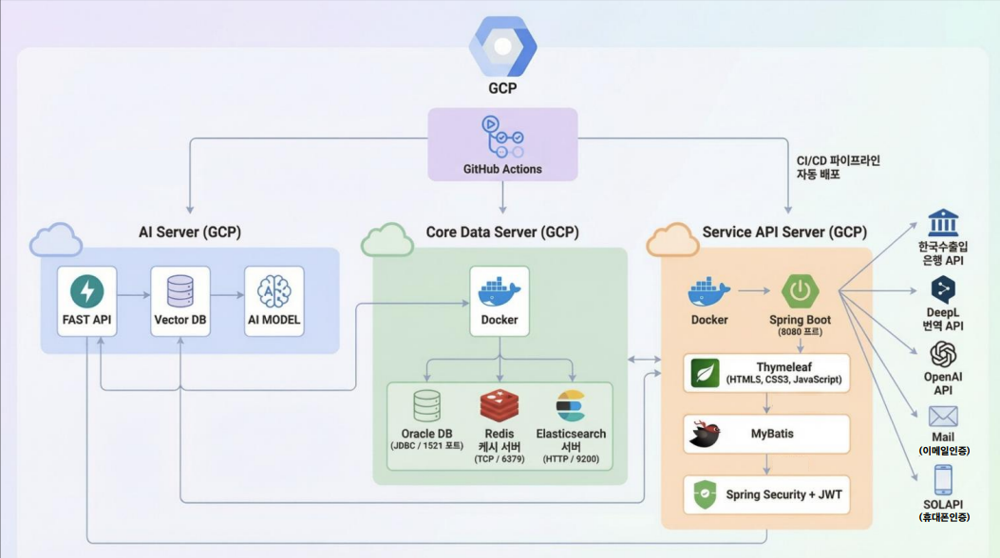

<div align="center">

# 🏦 FLOBANK

### 금융권 채널계·계정계 구조를 구현한 AI 기반 핀테크 웹 애플리케이션

**Spring Boot · TCP/IP Socket · Oracle · Redis · Elasticsearch · OpenAI · Pinecone**
부산은행 × 그린컴퓨터아카데미 산학 협력 은행 앱 개발 프로젝트
🏆 최우수상 수상 프로젝트

<br />

[](https://openjdk.org/)
[](https://spring.io/projects/spring-boot)
[](https://www.oracle.com/database/)
[](https://www.elastic.co/elasticsearch)
[](https://openai.com/)

<br />

[📌 프로젝트 개요](#-프로젝트-개요) · [👥 팀원 소개](#-팀원-소개) · [✨ 주요 기능](#-주요-기능) · [🖼️ 실행 화면](#️-실행-화면) · [🧱 아키텍처](#-아키텍처) · [🚀 실행 방법](#-실행-방법)

</div>

---

## 📌 프로젝트 개요

**FLOBANK**는 실제 금융권 시스템의 구조를 참고해 **채널계 API 서버**와 **계정계 Core Banking 서버**를 분리하고, 두 서버를 **TCP/IP 소켓 통신**으로 연동한 차세대 뱅킹 서비스 프로젝트입니다.

수신, 이체, 외환, 해외송금 등 기본 금융 업무를 구현하는 데서 나아가 **OpenAI**, **Vector DB**, **Elasticsearch**, **Python 크롤러**를 결합해 사용자에게 더 빠르고 똑똑한 금융 경험을 제공하는 것을 목표로 합니다.

| 구분 | 내용 |
| :--- | :--- |
| **프로젝트명** | FLOBANK / 플로뱅크 |
| **팀** | Busan Bank Project 1 Team 1 |
| **개발 기간** | 2025.11.05 ~ 2025.12.05 |
| **핵심 키워드** | 인터넷뱅킹, 외환, 해외송금, AI 챗봇, PDF 분석, 통합 검색, TCP/IP 전문 통신 |
| **발표 자료** | [1조 발표자료 최종본.pdf](https://github.com/user-attachments/files/24046389/1.pdf) |

---

## 👥 팀원 소개

| 역할 | 이름 |
| :---: | :---: |
| 🧑‍💼 **팀장** | **이민준** |
| 👨‍💻 팀원 | 김대현 | 
| 👩‍💻 팀원 | 이다은 | 
| 👨‍💻 팀원 | 이지민 | 
| 👨‍💻 팀원 | 서현우 | 
| 👨‍💻 팀원 | 전용준 |

---

## ✨ 주요 기능

### 🏦 1. 뱅킹 서비스

- **입출금 계좌 개설**: 비대면 계좌 개설 및 계좌 기본 정보 관리
- **예·적금 상품**: 상품 조회, 가입, 해지, 이자 계산 로직 제공
- **이체 서비스**: 당행/타행 이체, 거래 내역 조회, 이체 한도 검증
- **관리자 상품 관리**: 금융 상품 등록, 수정, 삭제 및 운영 관리

### 💱 2. 외환·해외송금 서비스

- **실시간 환율 정보**: Python 크롤러를 통한 환율 데이터 수집 및 제공
- **환전 지갑**: 외화 매입/매도, 환전 신청, 보유 외화 관리
- **해외 송금**: SWIFT 코드 기반 해외 송금 신청 및 진행 상태 조회
- **외화 상품**: 기존 원화 상품과 차별화된 외화 예금 상품 설계

### 🤖 3. AI 금융 서비스

- **AI 챗봇 Flo-Bot**: 금융 지식 기반 질의응답 및 서비스 안내
- **RAG 기반 답변**: Pinecone Vector DB와 내부 데이터를 활용한 검색 증강 생성
- **PDF 문서 분석**: 금융 상품 설명서/약관 업로드 후 핵심 내용 요약 및 분석
- **다국어 번역**: 외국인 고객을 위한 실시간 번역 지원

### 🔎 4. 검색·데이터 자동화

- **Elasticsearch 통합 검색**: 상품, 공지사항, FAQ, 이벤트 통합 검색
- **자동 완성 및 유사 검색**: 검색 편의성을 높이는 추천/보정 기능
- **금리·환율 크롤링**: 외부 금융 데이터를 주기적으로 수집해 서비스에 반영

### 🔐 5. 보안·인증

- **Spring Security + JWT**: Stateless 인증 및 역할 기반 접근 제어
- **휴대폰/이메일 인증**: Solapi SMS, SMTP 이메일 인증 연동
- **개인정보 암호화**: 민감 정보 암호화 및 비밀번호 단방향 암호화

---

## 🖼️ 실행 화면

### 실행 화면 1

<p align="center">
  
</p>

### 실행 화면 2

<p align="center">
  
</p>

---

## 🧱 아키텍처

<p align="center">
  
</p>

### 서버 구성

| 모듈 | 설명 |
| :--- | :--- |
| `flobank-api` | 사용자 요청을 처리하는 채널계 웹/API 서버입니다. Thymeleaf 화면, 인증, 검색, AI 연동, TCP Client 기능을 담당합니다. |
| `flobank-ap` | 핵심 금융 트랜잭션을 처리하는 계정계 서버입니다. TCP Server로 요청을 수신하고 계좌/이체 등 핵심 로직을 수행합니다. |
| `flobank-ai` | 챗봇, 브리핑, PDF 분석 등 AI 기반 기능을 처리하는 Python AI 서버 영역입니다. |
| `terms` | 약관 및 금융 문서 분석에 활용되는 데이터 리소스입니다. |

---

## 📂 디렉토리 구조

```bash
FLOBANK-Project1
├── flobank-api/                 # 채널계 웹/API 서버
│   ├── crawl/                   # 금리/환율 크롤링 스크립트
│   ├── src/main/java/           # Spring Boot 애플리케이션 코드
│   ├── src/main/resources/      # 설정, Mapper, 정적 자원, Thymeleaf 템플릿
│   └── docker-compose.yml       # API 관련 실행 환경
├── flobank-ap/                  # 계정계 Core Banking 서버
│   ├── src/main/java/           # TCP Server 및 금융 트랜잭션 로직
│   ├── src/main/resources/      # MyBatis Mapper 및 설정
│   └── docker-compose.yml       # AP 관련 실행 환경
├── flobank-ai/                  # AI 챗봇, 브리핑, PDF 분석 서버
├── terms/                       # 약관/문서 데이터
├── images/                      # README 실행 화면 이미지
└── README.md
```

---

## 🛠️ 기술 스택

| 영역 | 기술 |
| :--- | :--- |
| **Backend** | Java 21, Spring Boot 3.5.7, Spring MVC, Spring Integration, MyBatis |
| **Frontend** | Thymeleaf, HTML5, CSS3, JavaScript, Bootstrap, jQuery, Chart.js |
| **Database/Cache** | Oracle Database, Redis |
| **Search** | Elasticsearch 8.x |
| **AI/Data** | OpenAI API, Pinecone Vector DB, Python, Selenium |
| **Auth/Security** | Spring Security, JWT, Solapi SMS, SMTP Mail |
| **Infra/Tools** | Docker, Docker Compose, GitHub Actions, Git, GitHub |

---

## 🚀 실행 방법

### 1. 레포지토리 클론

```bash
git clone https://github.com/greenbnk2/busan-bank-project1-team1.git
cd busan-bank-project1-team1
```

### 2. 환경 변수 및 설정 파일 준비

다음 항목은 로컬 환경에 맞게 설정해야 합니다.

- Oracle DB 접속 정보
- Redis/Elasticsearch 접속 정보
- OpenAI API Key
- Pinecone API Key
- Solapi SMS Key
- SMTP Mail 정보

### 3. API 서버 실행

```bash
cd flobank-api
./gradlew bootRun
```

### 4. AP 서버 실행

```bash
cd flobank-ap
./gradlew bootRun
```

### 5. 접속

- Web: `http://localhost:8080`
- AP 관리/확인용 포트는 환경 설정에 따라 달라질 수 있습니다.

---

## ✅ 프로젝트 포인트

- 금융권에서 사용하는 **채널계/계정계 분리 구조**를 직접 구현했습니다.
- 단순 CRUD를 넘어 **TCP/IP 전문 통신 기반의 서버 간 연동**을 구현했습니다.
- AI 챗봇, PDF 분석, 번역, 통합 검색 등 **사용자 경험 중심의 금융 서비스**를 확장했습니다.
- 크롤링과 검색 엔진을 활용해 **데이터 수집·검색 자동화 흐름**을 구성했습니다.

---

<div align="center">

### 💙 FLOBANK

**Flow your finance, FLOBANK**

</div>
